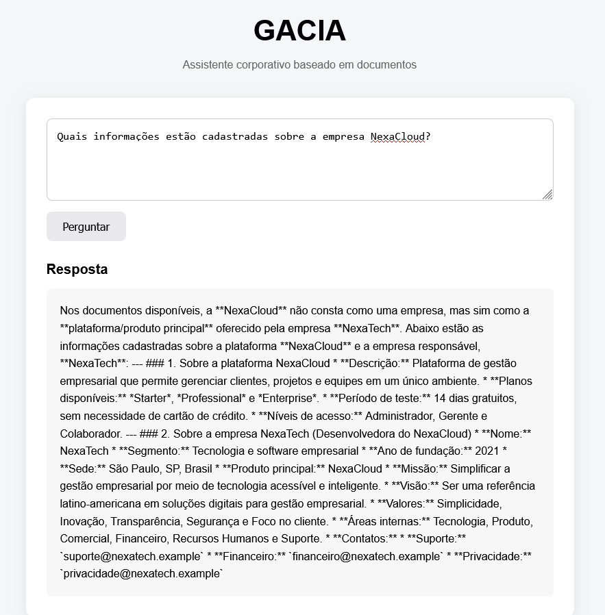
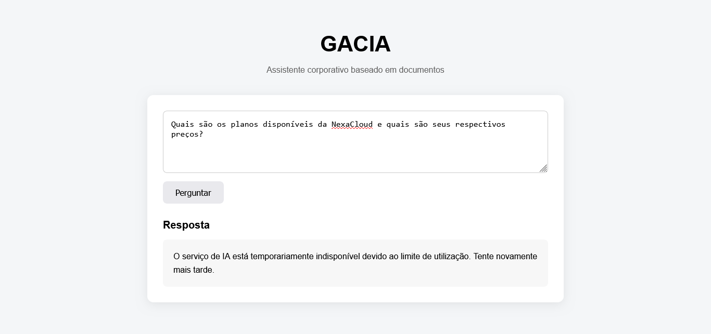

# GACIA

**GACIA (Generative AI Corporate Information Assistant)** é um assistente corporativo baseado em inteligência artificial e recuperação de informações a partir de documentos empresariais.

O projeto tem como objetivo demonstrar a construção de uma aplicação capaz de responder perguntas utilizando uma base de conhecimento fornecida pela empresa, evitando respostas baseadas exclusivamente no conhecimento geral do modelo de linguagem.

O projeto foi desenvolvido para o **Oracle Next Education**, com apoio da **Alura Cursos**, Turma G10, como parte do **Tech AI Builder**.

O nome **GACIA** é fictício e foi criado a partir da combinação das iniciais do autor com a ideia de inteligência artificial, formando o acrônimo *Generative AI Corporate Information Assistant*.

> **Status:** MVP funcional em desenvolvimento/finalização.

---

## Sobre o projeto

O GACIA foi desenvolvido como um projeto experimental de aplicação baseada em inteligência artificial generativa.

A proposta é permitir que uma empresa disponibilize uma base de documentos internos, como:

* FAQs;
* políticas;
* manuais;
* tabelas de preços;
* documentos institucionais;
* contratos;
* planilhas;
* outros documentos corporativos.

O usuário pode fazer perguntas em linguagem natural. O sistema utiliza o **Google Gemini com File Search** para localizar informações relevantes na base de conhecimento antes de gerar a resposta.

O foco do projeto é manter uma aplicação **simples, funcional e objetiva**, concentrada na consulta de informações corporativas por meio de linguagem natural.

---

## Funcionalidades

* Interface web para perguntas e respostas;
* Integração com Google Gemini API;
* Utilização do Gemini File Search;
* Busca baseada em documentos;
* Respostas fundamentadas na base de conhecimento;
* Instruções para evitar respostas não fundamentadas nos documentos;
* Tratamento de informações não encontradas;
* Suporte a diferentes formatos de documentos;
* API HTTP desenvolvida com FastAPI;
* Deploy em Oracle Cloud Infrastructure (OCI);
* Histórico local de conversas utilizando `localStorage` *(em implementação)*;
* Interface responsiva para desktop e dispositivos móveis *(em implementação)*.

---

## Arquitetura

A aplicação utiliza uma arquitetura simples, composta por frontend, API, agente de IA e base documental.

```text
Usuário
   │
   ▼
Interface Web
   │
   ▼
FastAPI
   │
   ▼
GACIA Agent
   │
   ▼
Google Gemini
   │
   ▼
File Search
   │
   ▼
Base de documentos
```

O histórico das conversas será tratado separadamente no navegador:

```text
Interface Web
      │
      ├──► FastAPI ──► Gemini / File Search
      │
      └──► localStorage
             │
             └── Histórico local
```

Essa abordagem permite implementar o histórico sem a necessidade de um banco de dados adicional na infraestrutura da aplicação.

---

## Tecnologias

### Backend

* Python
* FastAPI
* Uvicorn

### Inteligência Artificial

* Google Gemini API
* Gemini File Search

### Frontend

* HTML
* CSS
* JavaScript

### Dados

A base de conhecimento pode utilizar diferentes formatos de documentos, incluindo:

* Markdown
* CSV
* JSON
* PDF
* DOCX
* XLSX

### Infraestrutura e versionamento

* Git
* GitHub
* Oracle Cloud Infrastructure (OCI)

---

## Estrutura do projeto

```text
gacia/
│
├── app/
│   ├── agent.py
│   ├── documents.py
│   ├── gemini.py
│   ├── knowledge.py
│   ├── main.py
│   ├── setup_knowledge.py
│   ├── test_agent.py
│   ├── test_file_search.py
│   └── test_gemini.py
│
├── documents/
│   └── Base de conhecimento
│
├── static/
│   ├── index.html
│   ├── script.js
│   └── style.css
│
├── .env
├── .gitignore
├── requirements.txt
└── README.md
```

> A estrutura do frontend poderá ser atualizada durante a implementação da nova interface.

---

# Instalação e execução

## Pré-requisitos

* Python 3.11 ou superior;
* Uma chave da API do Google Gemini;
* Um File Search Store configurado no Google Gemini;
* Git, caso o projeto seja obtido pelo GitHub.

---

## Clonar o projeto

```bash
git clone https://github.com/GAClaro/gacia.git
cd gacia
```

---

## Criar o ambiente virtual

No Git Bash:

```bash
python -m venv .venv
```

---

## Ativar o ambiente virtual

No Git Bash:

```bash
source .venv/Scripts/activate
```

No Windows CMD:

```cmd
.venv\Scripts\activate
```

---

## Instalar as dependências

```bash
python -m pip install -r requirements.txt
```

---

## Configurar as variáveis de ambiente

Crie um arquivo `.env` na raiz do projeto:

```env
GEMINI_API_KEY=SUA_CHAVE_DA_API
FILE_SEARCH_STORE_NAME=fileSearchStores/SEU_STORE
```

**Nunca publique a chave da API no GitHub.**

O arquivo `.env` deve permanecer fora do controle de versão.

---

## Executar a aplicação

Com o ambiente virtual ativado:

```bash
python -m uvicorn app.main:app --reload
```

A aplicação estará disponível localmente em:

```text
http://127.0.0.1:8000
```

Abra o endereço no navegador para utilizar o GACIA.

---

# Deploy na Oracle Cloud Infrastructure

O GACIA foi configurado para execução em uma instância de computação da **Oracle Cloud Infrastructure (OCI)**.

A aplicação utiliza uma instância virtual com Ubuntu Server e disponibiliza a API e a interface web por meio de um endereço IPv4 público.

### Ambiente utilizado

* **Cloud:** Oracle Cloud Infrastructure
* **Sistema operacional:** Ubuntu 24.04
* **Forma:** VM.Standard.E2.1.Micro
* **OCPU:** 1
* **Memória:** 1 GB
* **Armazenamento:** aproximadamente 50 GB
* **Servidor:** Uvicorn
* **API:** FastAPI
* **Porta da aplicação:** 8000

### Aplicação em produção

```text
http://SEU-ENDERECO-PUBLICO:8000
```

> Substitua `SEU-ENDERECO-PUBLICO` pelo endereço IPv4 público utilizado durante a avaliação.

---

# Primeiros testes na OCI

A primeira versão do GACIA foi disponibilizada na Oracle Cloud Infrastructure em **19 de agosto de 2026**.

Após a configuração da instância, instalação das dependências e execução do servidor Uvicorn, a aplicação foi acessada externamente através do endereço público da instância.

O primeiro teste de conectividade confirmou que a aplicação estava respondendo pela porta `8000`.

Também foram realizados testes de perguntas utilizando documentos da base de conhecimento.

### Teste 1 — Funcionamento da aplicação

> **Descrição:** Primeiro acesso à aplicação GACIA hospedada na OCI.

**Print do teste:**

<!-- INSIRA AQUI O PRIMEIRO PRINT -->



---

### Teste 2 — Pergunta baseada na documentação

> **Descrição:** Primeiro teste funcional utilizando a base de conhecimento do GACIA.

**Print do teste:**

<!-- INSIRA AQUI O SEGUNDO PRINT -->



---

### Observação sobre os testes iniciais

Os primeiros testes confirmaram o funcionamento da arquitetura completa em ambiente de nuvem:

```text
Navegador
   ↓
Internet
   ↓
Oracle Cloud Infrastructure
   ↓
Instância Ubuntu
   ↓
Uvicorn
   ↓
FastAPI
   ↓
GACIA Agent
   ↓
Google Gemini / File Search
   ↓
Documentos
```

Durante os testes iniciais, a aplicação também foi submetida a múltiplas consultas consecutivas. O limite de utilização da API do Google Gemini foi atingido durante essa etapa, fazendo com que o processo do servidor fosse encerrado.

Esse comportamento está relacionado ao limite de utilização da API e não à indisponibilidade da infraestrutura da OCI.

---

# Executar os testes do agente

```bash
python -m app.test_agent
```

Também estão disponíveis testes para os componentes de Gemini e File Search:

```bash
python -m app.test_gemini
python -m app.test_file_search
```

---

# Exemplos de perguntas

As respostas abaixo são exemplos baseados na base de conhecimento fictícia utilizada no projeto.

## Exemplo 1 — Planos e API

**Pergunta:**

> Quais planos possuem acesso à API?

**Resposta esperada:**

> Os planos que possuem acesso à API são o **Professional** e o **Enterprise**. O plano Starter não possui acesso a esse recurso.

---

## Exemplo 2 — Número de usuários

**Pergunta:**

> Quantos usuários estão incluídos no plano Enterprise?

**Resposta esperada:**

> O plano Enterprise inclui até **100 usuários**.

---

## Exemplo 3 — Reembolso

**Pergunta:**

> Qual é o prazo para solicitar reembolso de uma assinatura anual?

**Resposta esperada:**

> Clientes que contrataram um plano anual podem solicitar reembolso em até **7 dias corridos após a contratação**, observadas as condições previstas na política de reembolso.

---

## Exemplo 4 — Período de teste

**Pergunta:**

> Quantos dias dura o período de teste?

**Resposta esperada:**

> O período de teste gratuito é de **14 dias**.

---

## Exemplo 5 — Manual

**Pergunta:**

> Como adiciono um novo usuário na NexaCloud?

**Resposta esperada:**

> Um usuário com permissão administrativa deve acessar **Configurações > Equipe > Adicionar usuário**, informar o nome e o e-mail, escolher o nível de acesso e enviar o convite.

---

## Exemplo 6 — Informação não encontrada

**Pergunta:**

> Qual é o salário médio dos funcionários da NexaTech?

**Resposta esperada:**

> Não encontrei essa informação nos documentos disponíveis.

Esse último comportamento é especialmente importante: o GACIA deve evitar inventar informações quando a base de conhecimento não contém uma resposta suficiente.

---

# Funcionamento resumido

```text
Usuário
   ↓
Interface Web
   ↓
FastAPI
   ↓
GACIA Agent
   ↓
Google Gemini
   ↓
File Search
   ↓
Documentos da empresa
```

O agente recebe a pergunta, consulta a base de conhecimento por meio do File Search e utiliza as informações encontradas para produzir a resposta.

O histórico das conversas será armazenado localmente no navegador por meio do `localStorage`, evitando a necessidade de um banco de dados para essa funcionalidade.

---

# Segurança

A chave da API deve ser armazenada exclusivamente em variáveis de ambiente ou em um arquivo `.env` que não seja enviado ao GitHub.

Não coloque credenciais, chaves de API ou informações privadas de clientes nos arquivos versionados do projeto.

O GACIA não deve ser utilizado para inserir informações confidenciais ou dados pessoais reais na base de conhecimento utilizada para demonstração.

---

# Escopo do projeto

O GACIA foi deliberadamente mantido como uma aplicação simples e focada.

O objetivo desta versão é demonstrar:

* integração com inteligência artificial generativa;
* recuperação de informações em documentos;
* construção de um agente baseado em uma base de conhecimento;
* desenvolvimento de uma interface web;
* comunicação entre frontend e backend;
* disponibilização de uma aplicação em ambiente de nuvem;
* utilização da aplicação em diferentes dispositivos.

Funcionalidades como autenticação, gerenciamento administrativo, múltiplas empresas, upload de documentos pela interface e dashboards **não fazem parte do escopo desta versão**.

A decisão permite concentrar o desenvolvimento na qualidade, usabilidade e funcionamento da aplicação principal.

---

# Roadmap

* [x] Estrutura inicial do projeto
* [x] Integração com Google Gemini
* [x] Integração com File Search
* [x] Agente de perguntas e respostas
* [x] Interface web inicial
* [x] Base inicial de documentos
* [x] Repositório GitHub
* [x] Testes com diferentes formatos de documentos
* [x] Deploy na Oracle Cloud Infrastructure (OCI)
* [ ] Novo frontend responsivo e profissional
* [ ] Histórico local de conversas com `localStorage`
* [ ] Testes em desktop e dispositivos móveis
* [ ] Documentação final e demonstração da aplicação

---

# Status

**MVP funcional em desenvolvimento/finalização.**

O GACIA possui backend funcional, integração com inteligência artificial, recuperação de informações por documentos e deploy em ambiente de nuvem.

A etapa atual concentra-se na evolução da interface e na experiência de utilização, mantendo o escopo simples e direcionado à proposta principal do projeto.

---

# Autor

**Guilherme de Almeida Claro**

Projeto independente de desenvolvimento de aplicação baseada em inteligência artificial generativa, realizado para o **Desafio Alura do Programa Tech AI Builder**.
